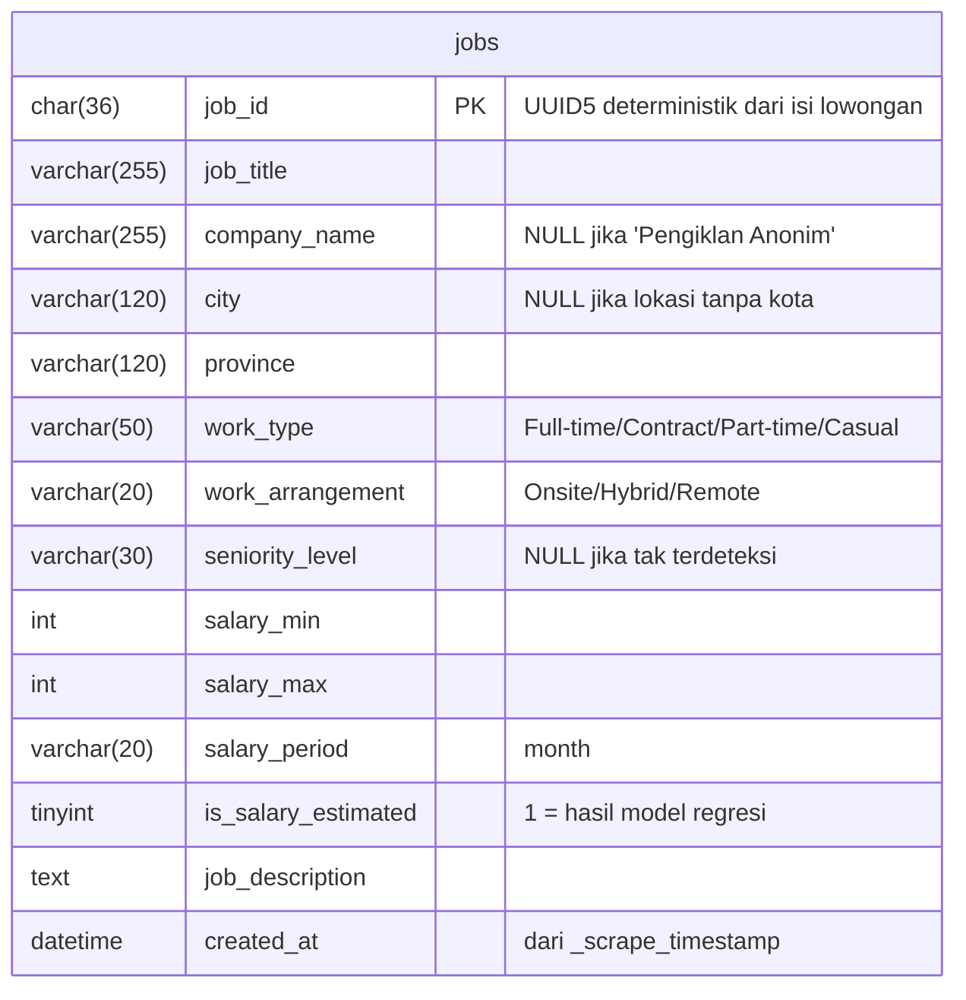

# ERD — Database MySQL (JobPath)

Skema relasional yang dibuat oleh `notebooks/data_ingestion.ipynb`. Dataset lowongan
bersifat datar (satu lowongan = satu baris), sehingga cukup **satu tabel** `jobs`
(sesuai panduan dataset yang membolehkan penggabungan menjadi satu tabel).

## Diagram



> `jobs` berdiri sendiri di MySQL, tetapi `job_id` juga menjadi **`point_id` di Qdrant**
> (lihat [`qdrant.md`](qdrant.md)) — inilah jembatan antara pencarian semantik dan data
> terstruktur. Bukan foreign key SQL, melainkan kunci lintas-basis-data.
>
> Selain `job_id`, kolom `job_description` juga mengalir ke Qdrant: `job_title` +
> `job_description` menjadi teks yang di-embed **dan** disimpan di payload `content`
> (dokumen sumber RAG). Field terstruktur lain disalin ke `metadata` payload.

## Definisi kolom

| Kolom | Tipe | Null | Keterangan / asal |
|---|---|---|---|
| `job_id` | CHAR(36) | PK | `UUID5(namespace, job_title\|company_name\|location\|job_description)` — stabil antar-run, dasar idempotency |
| `job_title` | VARCHAR(255) | NOT NULL | apa adanya dari dataset |
| `company_name` | VARCHAR(255) | NULL | `"Pengiklan Anonim"` dinormalisasi menjadi NULL |
| `city` | VARCHAR(120) | NULL | bagian pertama `location` (NULL bila lokasi hanya provinsi) |
| `province` | VARCHAR(120) | NULL | bagian terakhir `location` setelah membuang penanda dalam kurung |
| `work_type` | VARCHAR(50) | NULL | dinormalisasi: Full time→Full-time, Kontrak/Temporer→Contract, Paruh waktu→Part-time, Kasual→Casual |
| `work_arrangement` | VARCHAR(20) | NULL | Onsite / Hybrid / Remote — dideteksi dari penanda pada `location` |
| `seniority_level` | VARCHAR(30) | NULL | dari kata kunci judul; bila tak ada, dari tahun pengalaman (Entry/Mid/Senior); NULL bila nihil |
| `salary_min` | INT | NULL | Rupiah per bulan; hasil parse atau estimasi model |
| `salary_max` | INT | NULL | Rupiah per bulan; sama dengan `salary_min` bila nilai tunggal/estimasi |
| `salary_period` | VARCHAR(20) | NULL | saat ini seragam `month` |
| `is_salary_estimated` | TINYINT(1) | NOT NULL | `1` bila `salary_*` diisi model regresi (`FR-8.01`); `0` bila dari data asli |
| `job_description` | TEXT | NULL | teks penuh; sumber dokumen RAG |
| `created_at` | DATETIME | NULL | dari `_scrape_timestamp` |

## DDL

```sql
CREATE TABLE IF NOT EXISTS jobs (
    job_id           CHAR(36)     PRIMARY KEY,
    job_title        VARCHAR(255) NOT NULL,
    company_name     VARCHAR(255) NULL,
    city             VARCHAR(120) NULL,
    province         VARCHAR(120) NULL,
    work_type        VARCHAR(50)  NULL,
    work_arrangement VARCHAR(20)  NULL,
    seniority_level  VARCHAR(30)  NULL,
    salary_min       INT          NULL,
    salary_max       INT          NULL,
    salary_period    VARCHAR(20)  NULL,
    is_salary_estimated TINYINT(1) NOT NULL DEFAULT 0,
    job_description  TEXT         NULL,
    created_at       DATETIME     NULL
);
```

## Idempotency

Ingestion memakai `INSERT ... ON DUPLICATE KEY UPDATE` dengan `job_id` sebagai PK.
Menjalankan ulang notebook memperbarui baris yang sama, **tidak menggandakan**.

## Indeks yang disarankan (untuk NFR-2.02: filter SQL ≤ 5 detik)

Belum dibuat otomatis oleh notebook; tambahkan bila volume data bertambah:

```sql
CREATE INDEX idx_jobs_province      ON jobs (province);
CREATE INDEX idx_jobs_work_type     ON jobs (work_type);
CREATE INDEX idx_jobs_arrangement   ON jobs (work_arrangement);
CREATE INDEX idx_jobs_salary        ON jobs (salary_min, salary_max);
CREATE INDEX idx_jobs_seniority     ON jobs (seniority_level);
```

Kolom-kolom tersebut menopang filter Smart Search (`FR-3.02`–`FR-3.04`) dan agregasi
Market Insight (`FR-7.02`).
